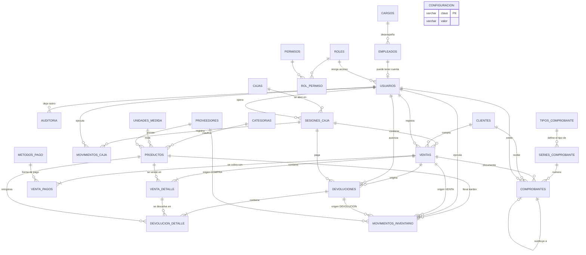

# 3. Diseño de la Base de Datos (MySQL 8)

**Proyecto:** Sistema de Venta de Productos
**Documento:** 03 — Modelo de datos
**Motor:** MySQL 8.0+ · InnoDB · `utf8mb4_0900_ai_ci`
**Scripts:** [`sql/01_schema_mysql.sql`](sql/01_schema_mysql.sql) · [`sql/02_datos_iniciales.sql`](sql/02_datos_iniciales.sql)

---

## 3.1 Criterios de diseño

| # | Criterio | Aplicación |
|---|----------|------------|
| 1 | Normalización hasta 3FN | Catálogos separados (categorías, unidades, métodos de pago, tipos de comprobante). Todo valor derivable dentro de la misma fila es **columna generada**, no una columna que alguien deba mantener. Auditoría completa en §3.4. |
| 2 | Desnormalización controlada | `venta_detalle` copia `descripcion` y `precio_unitario`, y `productos.stock_actual` guarda el saldo. Un cambio de precio o de nombre no altera las ventas ya emitidas, y el POS no recalcula el stock sumando el kardex en cada consulta. |
| 3 | Integridad referencial | **Todas** las relaciones con `FOREIGN KEY`, incluida la del kardex a su documento de origen (una FK por origen, con `CHECK` de exclusividad). Ninguna referencia polimórfica. `RESTRICT` por defecto; `CASCADE` solo en detalles que no existen sin su cabecera. |
| 4 | Sin borrado físico | Catálogos con bandera `activo`; las ventas se anulan, no se eliminan (un trigger bloquea el `DELETE`). |
| 5 | Trazabilidad total | `movimientos_inventario` es una tabla append-only que registra todo cambio de stock con su documento de origen. `auditoria` registra las operaciones sensibles. |
| 6 | Atomicidad | Venta, detalle, pagos y movimientos de stock se escriben en una sola transacción InnoDB. |
| 7 | Precisión monetaria | `DECIMAL(12,2)` para dinero y `DECIMAL(12,3)` para cantidades. Nunca `FLOAT`. |
| 8 | Concurrencia | Correlativos y stock se toman con `SELECT ... FOR UPDATE` para evitar duplicados y sobreventa. |

## 3.2 Diagrama Entidad-Relación

Las 26 tablas del modelo. El diagrama dibuja 37 líneas para 40 claves foráneas: tres pares
de FK unen el mismo par de tablas y se solapan (quién registra y quién anula una venta, quién
abre y quién cierra la caja, quién registra y quién autoriza una devolución). `configuracion`
aparece suelta a propósito: es la tabla de parámetros del negocio y no se relaciona con
ninguna otra.



**Cómo leer la cardinalidad:** `||--o{` uno a muchos (el hijo puede tener cero filas) ·
`||--|{` uno a muchos con al menos una fila (una venta sin detalle no existe) ·
`||--o|` uno a uno opcional (un empleado puede no tener cuenta).

Los diagramas por módulo, con los atributos y las claves de cada tabla, están en la versión
publicada de este documento: **https://claude.ai/code/artifact/9507f236-7d41-4243-9eee-4d431aaacecf**

## 3.3 Módulos y tablas

| Módulo | Tablas |
|--------|--------|
| Personal y seguridad | `cargos`, `empleados`, `roles`, `permisos`, `rol_permiso`, `usuarios` |
| Catálogo | `categorias`, `unidades_medida`, `proveedores`, `productos` |
| Clientes | `clientes` (persona natural / jurídica) |
| Caja | `cajas`, `sesiones_caja`, `movimientos_caja` |
| Comprobantes | `tipos_comprobante`, `series_comprobante`, **`comprobantes`**, `metodos_pago` |
| Ventas | `ventas`, `venta_detalle`, `venta_pagos` |
| Devoluciones | `devoluciones`, `devolucion_detalle` |
| Inventario | `movimientos_inventario` |
| Sistema | `configuracion`, `auditoria` |

**Total: 26 tablas, 9 vistas, 6 triggers y 6 procedimientos almacenados.**

## 3.4 Auditoría de normalización (1FN → 3FN)

### Inventario de tablas

| # | Tabla | Clave primaria | Verdicto |
|:-:|-------|----------------|----------|
| 1 | `cargos` | `id` | 3FN |
| 2 | `empleados` | `id` | 3FN — la persona y su vínculo laboral |
| 3 | `roles` | `id` | 3FN |
| 4 | `permisos` | `id` | 3FN |
| 5 | `rol_permiso` | `(rol_id, permiso_id)` | 3FN — tabla puente de N:M |
| 6 | `usuarios` | `id` | 3FN — solo credenciales y rol; 1:1 opcional con `empleados` |
| 7 | `categorias` | `id` | 3FN |
| 8 | `unidades_medida` | `id` | 3FN |
| 9 | `proveedores` | `id` | 3FN |
| 10 | `productos` | `id` | 3FN + `stock_actual` derivado (justificado) |
| 11 | `clientes` | `id` | 3FN — subtipos natural/jurídica en una tabla con `CHECK` |
| 12 | `cajas` | `id` | 3FN |
| 13 | `sesiones_caja` | `id` | 3FN — `diferencia` corregida a columna generada |
| 14 | `movimientos_caja` | `id` | 3FN |
| 15 | `tipos_comprobante` | `id` | 3FN |
| 16 | `series_comprobante` | `id` | 3FN |
| 17 | `metodos_pago` | `id` | 3FN |
| 18 | `ventas` | `id` | 3FN — `total` corregido a columna generada |
| 19 | `venta_detalle` | `id` | 3FN + copias históricas (justificadas) |
| 20 | `venta_pagos` | `id` | 3FN — `vuelto` corregido a columna generada |
| 21 | `comprobantes` | `id` | 3FN — se eliminó `tipo_comprobante_id` |
| 22 | `devoluciones` | `id` | 3FN + `total` agregado (justificado) |
| 23 | `devolucion_detalle` | `id` | 3FN |
| 24 | `movimientos_inventario` | `id` | 3FN — referencia polimórfica reemplazada por FK por origen |
| 25 | `configuracion` | `clave` | 3FN — tabla de parámetros clave/valor |
| 26 | `auditoria` | `id` | 3FN — bitácora, solo inserción |

**26 tablas.** Ninguna tiene grupos repetitivos ni columnas multivaluadas (1FN), ninguna
clave primaria es compuesta salvo la tabla puente `rol_permiso` —cuyos dos atributos son la
clave completa, sin dependencias parciales (2FN)—, y tras las correcciones de abajo ningún
atributo no clave depende de otro atributo no clave (3FN).

### Violaciones encontradas y corregidas

| Tabla | Problema | Corrección |
|-------|----------|------------|
| `comprobantes` | Guardaba `tipo_comprobante_id` **y** `serie_id`, pero la serie ya determina el tipo (`serie_id → series_comprobante.tipo_comprobante_id → tipo`). Dependencia transitiva y dos fuentes de verdad que podían contradecirse. **La prueba del delito:** había un trigger dedicado a comprobar que ambas coincidieran. | Se eliminó la columna. El tipo se obtiene con `JOIN series_comprobante`. Desapareció esa validación del trigger y `sp_emitir_comprobante` pasó de 3 parámetros de entrada a 2. |
| `ventas` | `total` = `subtotal − descuento + impuesto`, los tres en la misma fila: dependencia entre atributos no clave. Podía quedar desincronizado si alguien actualizaba un importe sin recalcular. | `total` es ahora **columna generada** `STORED`. Imposible desincronizar. |
| `comprobantes` | Mismo caso con su `total`. | Columna generada `STORED`. |
| `sesiones_caja` | `diferencia` = `monto_declarado − monto_esperado`, ambos en la misma fila. En un arqueo, una diferencia mal calculada es exactamente el dato que no se puede permitir. | Columna generada `STORED`. |
| `venta_pagos` | `vuelto` = `monto_recibido − monto`, ambos en la misma fila. | Columna generada `STORED` (0 cuando no hay `monto_recibido`, es decir, en pagos que no son en efectivo). |

Además se corrigió un **hueco funcional** detectado en la misma revisión: nada mantenía
`devoluciones.total`, `ventas.total_devuelto` ni el estado `DEVUELTA` / `DEVUELTA_PARCIAL`
de la venta, aunque HU-30 los exige. Ahora los mantiene
`trg_devolucion_detalle_after_insert`.

### Separación de empleado, cargo, rol y usuario

En la primera versión, `usuarios` mezclaba tres cosas: la **persona** (nombres, apellidos,
documento, teléfono), la **cuenta** (usuario, contraseña, último acceso) y, de hecho, el
**cargo** — porque los roles se llamaban "Cajero" y "Almacenero", que son puestos de trabajo,
no niveles de acceso. Consecuencias: un empleado sin cuenta no podía existir, no había dónde
anotar la fecha de ingreso ni el cese, y `activo` significaba a la vez "cuenta deshabilitada"
y "ya no trabaja aquí".

Ahora son cuatro conceptos en cuatro tablas:

| Tabla | Responde a | Ejemplo |
|-------|-----------|---------|
| `cargos` | ¿Qué hace en el negocio? | Gerente, Cajero, Almacenero, Ayudante |
| `empleados` | ¿Quién es y bajo qué vínculo trabaja? | Luis Ramos, cajero, ingresó el 01/03/2025, contrato indefinido |
| `roles` | ¿Qué puede hacer en el sistema? | Administrador, Cajero, Almacenero (conjuntos de permisos) |
| `usuarios` | ¿Con qué cuenta entra? | `cajero1`, rol Cajero, del empleado Luis Ramos |

- `empleados` → `usuarios` es **1:1 opcional**: `usuarios.empleado_id` es `NOT NULL` y
  `UNIQUE`, así que toda cuenta pertenece a un empleado y ningún empleado tiene dos cuentas,
  pero un empleado puede no tener ninguna (en los datos de ejemplo, el ayudante Jorge
  trabaja sin usar el sistema).
- **Cargo y rol quedan independientes.** Un cajero de confianza puede tener rol
  Administrador sin dejar de ser cajero, y eso ya no obliga a inventar un cargo falso.
- `empleados.estado` (`ACTIVO` / `SUSPENDIDO` / `CESADO`) es el vínculo laboral;
  `usuarios.activo` es el acceso. El trigger `trg_empleados_after_update` hace que el primero
  mande sobre el segundo: al cesar o suspender a alguien, su cuenta se desactiva sola. Al
  revés no ocurre — quitarle el acceso a alguien no lo despide.
- Dos `CHECK` mantienen coherente el cese: `CESADO` exige `fecha_cese`, y una `fecha_cese`
  exige estado `CESADO`; además el cese no puede ser anterior al ingreso.

Toda la trazabilidad del sistema (`ventas.usuario_id`, `sesiones_caja.usuario_apertura_id`,
`comprobantes.emitido_por`, `auditoria.usuario_id`…) **sigue apuntando a `usuarios`**, que es
lo correcto: quien ejecuta una operación es una cuenta, no una persona. El nombre para
mostrar se obtiene con un JOIN a `empleados`, y la vista `v_empleados` ya entrega persona,
cargo, cuenta y rol en una sola consulta.

### Integridad referencial del kardex

`movimientos_inventario` referenciaba su documento de origen con el par
`(referencia_tipo, referencia_id)` — una relación polimórfica, sin `FOREIGN KEY`: nada
impedía apuntar a una venta inexistente, y la integridad quedaba en manos de la aplicación.
En la tabla que sostiene la auditoría del inventario, eso es justo donde no conviene ceder.

Se reemplazó por **una clave foránea por origen**:

| Origen | Referencia |
|--------|------------|
| `VENTA`, `ANULACION` | `venta_id` → `ventas` |
| `DEVOLUCION` | `devolucion_id` → `devoluciones` |
| `COMPRA` | `proveedor_id` → `proveedores`, más `documento_externo` (guía o factura del proveedor) |
| `AJUSTE`, `INICIAL` | ninguna; el `motivo` pasa a ser obligatorio |

Un `CHECK` de exclusividad garantiza que cada origen traiga **exactamente** la referencia
que le corresponde y ninguna de las otras:

```sql
CONSTRAINT ck_movinv_origen CHECK (
    (origen IN ('VENTA','ANULACION')
         AND venta_id IS NOT NULL AND devolucion_id IS NULL AND proveedor_id IS NULL)
 OR (origen = 'DEVOLUCION'
         AND devolucion_id IS NOT NULL AND venta_id IS NULL AND proveedor_id IS NULL)
 OR (origen = 'COMPRA'
         AND venta_id IS NULL AND devolucion_id IS NULL)
 OR (origen IN ('AJUSTE','INICIAL')
         AND venta_id IS NULL AND devolucion_id IS NULL AND proveedor_id IS NULL
         AND documento_externo IS NULL)
),
-- un ajuste sin explicación es un descuadre sin responsable
CONSTRAINT ck_movinv_motivo CHECK (origen <> 'AJUSTE' OR motivo IS NOT NULL)
```

Beneficio adicional: el kardex puede mostrar el **documento real** en lugar de un par
`('ventas', 42)`. `v_kardex` ahora resuelve el número de comprobante de la venta, el
correlativo de la devolución o el proveedor y su guía, según el origen.

**Costo asumido:** agregar un origen nuevo (por ejemplo, transferencias entre almacenes)
exige agregar su columna FK y ampliar el `CHECK`, en vez de solo insertar un valor. Es un
`ALTER TABLE` por cada tipo de documento nuevo — a cambio, ninguna fila del kardex puede
apuntar a un documento que no existe.

### Desnormalizaciones deliberadas (y por qué se quedan)

Estas **no** son errores: son datos históricos o agregados con una razón concreta. La regla
que las separa de una redundancia es que el valor guardado **no siempre coincide** con el
que se calcularía hoy, y eso es justamente lo que se quiere.

| Dato | Se podría derivar de | Por qué se guarda |
|------|----------------------|-------------------|
| `venta_detalle.descripcion`, `precio_unitario`, `afecto_impuesto`, `tasa_impuesto` | `productos` y `configuracion` | Es el precio y el nombre **del día de la venta**. Si mañana sube el precio o cambia la tasa, la venta de ayer no puede cambiar con ellos. |
| `comprobantes.*` (nombre, documento, dirección, importes del cliente) | `clientes` y `ventas` | Un documento contable es inmutable: si el cliente cambia de razón social, la factura emitida no se altera. |
| `comprobantes.numero_completo` | `serie` + `numero` + `longitud` | El número impreso en el papel. Si mañana cambia el formato de la serie, el documento ya emitido conserva el suyo. |
| `productos.stock_actual` | `SUM` sobre `movimientos_inventario` | Sumar el kardex entero en cada tecla del lector de código de barras haría inviable el POS (RNF1: respuesta < 1 s). Lo mantienen los triggers dentro de la misma transacción. |
| `ventas.subtotal`, `impuesto` | `SUM` sobre `venta_detalle` | Agregado de otra tabla; lo recalcula `sp_recalcular_venta`. Evita agregaciones en cada listado de ventas. |
| `venta_detalle.cantidad_devuelta` | `SUM` sobre `devolucion_detalle` | Necesario para el `CHECK (cantidad_devuelta <= cantidad)`: una restricción no puede consultar otra tabla. |
| `devoluciones.total`, `ventas.total_devuelto` | `SUM` sobre los detalles | Mismo motivo: reportes y cierre de caja sin agregaciones anidadas. |
| `movimientos_inventario.stock_anterior` / `stock_resultante` | Recorriendo el kardex | Es un libro de auditoría: guardar el saldo antes y después es lo que permite ubicar dónde se rompió el inventario. Además, en un `AJUSTE` el signo no es deducible del tipo. |

### Lo que decidí no cambiar (y la alternativa)

- **`clientes` con subtipos en una sola tabla.** Un purista separaría en `clientes` +
  `clientes_natural` + `clientes_juridica` para eliminar las columnas nulas. No lo hice: son
  seis columnas opcionales, los dos `CHECK` ya impiden un registro incoherente, y el POS
  necesita el cliente completo en **cada** venta — dos JOIN extra por operación, en la
  pantalla más sensible al tiempo de respuesta, a cambio de pureza formal. Las columnas
  nulas por subtipo no violan 3FN.
Con esto **ninguna relación del esquema queda fuera del control del motor**: no hay
referencias polimórficas ni claves foráneas implícitas.

## 3.5 Diccionario de datos (tablas centrales)

### `empleados`

| Columna | Tipo | Nulo | Descripción |
|---------|------|:----:|-------------|
| `id` | INT UNSIGNED PK | No | Identificador |
| `cargo_id` | TINYINT FK | No | Puesto que desempeña (`cargos`) |
| `tipo_documento`, `documento` | ENUM + VARCHAR | No | DNI/CE/PAS; únicos en conjunto |
| `nombres`, `apellidos` | VARCHAR | No | Datos de la persona |
| `fecha_nacimiento`, `telefono`, `email`, `direccion` | — | Sí | Datos de contacto |
| `fecha_ingreso` | DATE | No | Inicio del vínculo laboral |
| `fecha_cese`, `motivo_cese` | DATE + VARCHAR | Sí | Solo si `estado = 'CESADO'` |
| `tipo_contrato` | ENUM | No | `INDEFINIDO`, `PLAZO_FIJO`, `PARCIAL`, `PRACTICAS` |
| `estado` | ENUM | No | `ACTIVO`, `SUSPENDIDO`, `CESADO` — **vínculo laboral**, no acceso |
| `nombre_completo` | VARCHAR(130) | No | **Columna generada**: `nombres + apellidos` |

### `usuarios`

| Columna | Tipo | Nulo | Descripción |
|---------|------|:----:|-------------|
| `id` | INT UNSIGNED PK | No | Identificador; es el que referencia toda la trazabilidad |
| `empleado_id` | INT FK **UQ** | No | Persona dueña de la cuenta; el índice único impide dos cuentas por empleado |
| `rol_id` | TINYINT FK | No | Rol de acceso (conjunto de permisos) |
| `usuario` | VARCHAR(40) UQ | No | Nombre de inicio de sesión |
| `password_hash` | VARCHAR(255) | No | Hash de la contraseña (RNF4) |
| `password_actualizado_en` | DATETIME | Sí | Último cambio de contraseña |
| `activo` | TINYINT(1) | No | **Acceso al sistema**, distinto de `empleados.estado` |
| `ultimo_acceso`, `intentos_fallidos` | — | — | Control de sesión y bloqueo |

### `productos`

| Columna | Tipo | Nulo | Descripción |
|---------|------|:----:|-------------|
| `id` | INT UNSIGNED PK | No | Identificador |
| `categoria_id` | SMALLINT FK | No | Categoría a la que pertenece |
| `unidad_medida_id` | TINYINT FK | No | Unidad de venta (UND, KG, LT…) |
| `proveedor_id` | INT FK | Sí | Proveedor habitual |
| `codigo` | VARCHAR(30) UQ | No | Código interno / SKU |
| `codigo_barras` | VARCHAR(50) UQ | Sí | Código de barras para el lector |
| `nombre` | VARCHAR(120) | No | Nombre comercial |
| `precio_compra` | DECIMAL(12,2) | No | Costo **sin impuesto**, base del margen |
| `precio_venta` | DECIMAL(12,2) | No | Precio vigente **sin impuesto** (base imponible) |
| `afecto_impuesto` | TINYINT(1) | No | 1 = se le agrega el impuesto al vender |
| `stock_actual` | DECIMAL(12,3) | No | Saldo actual de existencias |
| `stock_minimo` | DECIMAL(12,3) | No | Umbral que dispara la alerta (HU-22) |
| `activo` | TINYINT(1) | No | Baja lógica (HU-07) |

### `ventas`

| Columna | Tipo | Nulo | Descripción |
|---------|------|:----:|-------------|
| `id` | BIGINT UNSIGNED PK | No | Identificador |
| `cliente_id` | INT FK | Sí | `NULL` = cliente varios (venta al paso) |
| `usuario_id` | INT FK | No | Cajero que registró la venta |
| `sesion_caja_id` | INT FK | No | Turno de caja al que pertenece (HU-28) |
| `fecha` | DATETIME | No | Fecha y hora del servidor |
| `subtotal` | DECIMAL(12,2) | No | Base imponible: suma del detalle, **sin impuesto** |
| `descuento` | DECIMAL(12,2) | No | Descuento de cabecera, aplicado sobre la base |
| `impuesto` | DECIMAL(12,2) | No | Impuesto calculado sobre la base afecta neta de descuento |
| `total` | DECIMAL(12,2) | No | `subtotal − descuento + impuesto` |
| `total_devuelto` | DECIMAL(12,2) | No | Acumulado devuelto al cliente |
| `estado` | ENUM | No | `COMPLETADA`, `ANULADA`, `DEVUELTA_PARCIAL`, `DEVUELTA` |
| `anulada_en`, `anulada_por`, `motivo_anulacion` | — | Sí | Rastro de la anulación (HU-29) |

> El número de documento **ya no vive en `ventas`**: la venta es la operación comercial y el
> documento entregado al cliente está en `comprobantes` (relación 1 a 1). Así una venta
> interna puede existir sin documento, y el documento conserva sus propios datos y estado.

### `clientes` (persona natural / jurídica)

Un solo maestro con el discriminador `tipo_persona`. Las columnas propias de cada tipo son
nulas para el otro, y dos `CHECK` impiden que un cliente quede a medio llenar.

| Columna | Tipo | Aplica a | Descripción |
|---------|------|----------|-------------|
| `tipo_persona` | ENUM | ambos | `NATURAL` o `JURIDICA` |
| `tipo_documento` | ENUM | ambos | `DNI`, `CE`, `PAS`, `SIN` (natural) · `RUC` (jurídica) |
| `documento` | VARCHAR(20) | ambos | Único junto con `tipo_documento` |
| `nombres`, `apellidos` | VARCHAR | natural | Obligatorios si `tipo_persona = 'NATURAL'` |
| `fecha_nacimiento` | DATE | natural | Opcional |
| `razon_social` | VARCHAR(150) | jurídica | Obligatoria si `tipo_persona = 'JURIDICA'` |
| `nombre_comercial` | VARCHAR(120) | jurídica | Opcional |
| `representante_legal` | VARCHAR(120) | jurídica | Se imprime en la factura |
| `direccion` | VARCHAR(200) | ambos | **Obligatoria** para persona jurídica (dirección fiscal) |
| `nombre` | VARCHAR(150) | ambos | **Columna generada**: razón social, o `nombres + apellidos` |

Reglas garantizadas por la base de datos:

```sql
-- ck_clientes_natural
tipo_persona = 'NATURAL'  → nombres y apellidos obligatorios,
                            razon_social nula, documento en (DNI, CE, PAS, SIN)

-- ck_clientes_juridica
tipo_persona = 'JURIDICA' → razon_social, documento y direccion obligatorios,
                            nombres y apellidos nulos, tipo_documento = 'RUC'
```

La columna generada `nombre` permite que listados, búsquedas y comprobantes usen un solo
campo sin preguntar de qué tipo de cliente se trata.

### `comprobantes` (factura / recibo)

Apartado donde se guarda el documento entregado al cliente. Relación **1 a 1** con la venta.

| Columna | Tipo | Descripción |
|---------|------|-------------|
| `venta_id` | BIGINT FK | Venta documentada |
| `serie_id`, `numero` | FK + INT | Serie y correlativo; únicos en conjunto (HU-13). **La serie determina el tipo** (`FAC`, `REC`, `NV`): no se guarda el tipo aparte |
| `numero_completo` | VARCHAR(20) | Número formateado, ej. `F001-000126`, `R001-000341` |
| `fecha_emision` | DATETIME | Fecha del documento |
| `cliente_id` | INT FK | Cliente al que se emitió (`NULL` en venta al paso) |
| `tipo_persona` | ENUM | **Foto** del tipo de cliente al emitir |
| `cliente_nombre` | VARCHAR(150) | **Foto** de la razón social o nombre completo |
| `cliente_tipo_documento`, `cliente_documento` | ENUM + VARCHAR | **Foto** del RUC/DNI |
| `cliente_direccion` | VARCHAR(200) | **Foto** de la dirección fiscal |
| `representante_legal` | VARCHAR(120) | **Foto**, solo persona jurídica |
| `subtotal`, `descuento`, `impuesto`, `total` | DECIMAL(12,2) | **Foto** de los importes |
| `moneda` | VARCHAR(3) | Código ISO tomado de `configuracion` |
| `estado` | ENUM | `EMITIDO` (vigente), `ANULADO` (venta anulada) o `SUSTITUIDO` (reemplazado por otro) |
| `anulado_en`, `motivo_anulacion` | — | Rastro de la anulación del documento |
| `sustituye_a` | BIGINT FK self | Documento al que reemplaza (HU-42) |
| `sustituido_en` | DATETIME | Momento en que dejó de ser el vigente |
| `motivo_emision` | VARCHAR(255) | Por qué se emitió este reemplazo |
| `emitido_por` | INT FK | Usuario que emitió el documento |
| `venta_vigente_uk` | Generada + UQ | `venta_id` solo si `estado = 'EMITIDO'`: garantiza **un único comprobante vigente por venta** |
| `archivo_pdf` | VARCHAR(255) | Ruta del PDF generado (HU-14) |

**Por qué se guarda una foto y no solo la relación:** un comprobante es un documento
contable. Si mañana el cliente cambia de razón social o de dirección fiscal, la factura ya
emitida no puede cambiar con él. Lo mismo aplica a los importes: quedan congelados en el
documento aunque después se registre una devolución parcial sobre la venta.

### Venta al paso: cuando no se registra al cliente

Es el caso más frecuente en mostrador, y el modelo lo trata como el camino normal, no como
una excepción:

- `ventas.cliente_id` es **NULL** y `comprobantes.cliente_id` también.
- El comprobante se emite igual, a nombre del texto configurado en
  `configuracion.cliente_generico_nombre` (por defecto "Cliente varios"), con
  `cliente_tipo_documento = 'SIN'` y `cliente_documento = NULL`.
- El tipo de documento aplicable es el **recibo** (`exige_cliente = 0`), o la nota de venta.
- El cajero no escribe ni un dato: escanear → cobrar → imprimir.

**Una sola forma de representarlo.** No existe un registro semilla "Cliente varios" en la
tabla `clientes`. Tener las dos cosas —un cliente ficticio y el `NULL`— significa que la
mitad de las ventas anónimas quedarían apuntando a un cliente falso: ese registro terminaría
encabezando el reporte de mejores clientes y ensuciando el historial de compras. La regla
es: **sin cliente identificado, `cliente_id = NULL`**; el nombre genérico es un texto de
impresión, no una persona.

Consecuencias para las consultas:

```sql
-- correcto: LEFT JOIN, porque el cliente puede no existir
SELECT v.id, v.total, IFNULL(c.nombre, 'Cliente varios') AS cliente
  FROM ventas v LEFT JOIN clientes c ON c.id = v.cliente_id;

-- ventas al paso del día
SELECT COUNT(*) FROM ventas WHERE cliente_id IS NULL AND DATE(fecha) = CURDATE();
```

**Único caso en que el cajero está obligado a pedir datos:** si el cliente pide **factura**.
`tipos_comprobante.FAC` tiene `exige_cliente = 1` y `exige_documento = 1`, así que hay que
registrar a la persona jurídica con RUC y dirección fiscal antes de emitir. Es una exigencia
del documento, no del sistema.

**Si el cliente pide factura después de emitido el recibo:** se **sustituye** el comprobante
con `sp_sustituir_comprobante` (HU-42). No se anula la venta ni se toca el stock: el recibo
pasa a estado `SUSTITUIDO`, se asigna el cliente jurídico a la venta y se emite una factura
nueva que referencia al recibo en `sustituye_a`. Ver «Sustitución de comprobante» más abajo.

### `tipos_comprobante`

| Código | Nombre | `aplica_persona` | `exige_cliente` | `exige_documento` |
|--------|--------|------------------|:---------------:|:-----------------:|
| `FAC` | Factura | `JURIDICA` | Sí | Sí (RUC) |
| `REC` | Recibo | `NATURAL` | No | No |
| `NV` | Nota de venta | `AMBAS` | No | No |

Estas tres banderas son las que el trigger `trg_comprobantes_before_insert` usa para decidir
si el documento puede emitirse. Agregar un tipo nuevo (nota de crédito, guía) es insertar una
fila, no tocar código.

### Sustitución de comprobante (recibo → factura)

El caso real: la venta se cobró al paso y salió con recibo; al rato vuelve el cliente y dice
que era para su empresa, que necesita factura. **No se anula la venta** —la mercadería salió,
el dinero entró, el stock está bien— solo cambia el documento.

`sp_sustituir_comprobante(comprobante, serie, cliente, usuario, motivo)` hace, en una
transacción:

1. Valida que el documento esté **vigente** (`estado = 'EMITIDO'`) y que la venta esté
   `COMPLETADA` — no se sustituye el documento de una venta anulada.
2. Valida la ventana de tiempo: `configuracion.dias_max_sustitucion` (1 día por defecto).
   Cambiar un documento de hace tres meses no es una corrección, es otra cosa.
3. Asigna el cliente jurídico a la venta (`ventas.cliente_id`), que antes era nulo.
4. Marca el recibo como `SUSTITUIDO` con su `sustituido_en`. Esto **libera el índice único**,
   porque `venta_vigente_uk` solo tiene valor mientras el estado es `EMITIDO`.
5. Emite la factura con su **propio correlativo nuevo** (nunca se reutiliza un número), y el
   trigger valida que el cliente sea persona jurídica.
6. Enlaza la factura al recibo (`sustituye_a`) con el motivo y el usuario, y escribe en
   `auditoria`.

Resultado en la tabla:

| numero_completo | estado | sustituye_a | sustituido_en |
|---|---|---|---|
| `R001-000002` | `SUSTITUIDO` | — | 2026-08-19 11:40 |
| `F001-000002` | `EMITIDO` | `R001-000002` | — |

Nada se borra ni se edita: el recibo entregado existió y queda registrado. La vista
`v_comprobantes_sustituidos` muestra la cadena completa para auditoría, y
`v_ventas_comprobante` excluye los sustituidos para que una venta no aparezca dos veces en
los listados.

> **Ojo con el reporte de ventas.** `v_comprobantes_emitidos` filtra `estado = 'EMITIDO'`, así
> que un documento sustituido no se suma dos veces a la facturación del día. La venta, en
> cambio, sigue siendo una sola en `ventas`: la sustitución nunca duplica ingresos.

### `venta_detalle`

| Columna | Tipo | Nulo | Descripción |
|---------|------|:----:|-------------|
| `venta_id` | BIGINT FK | No | Venta a la que pertenece (`ON DELETE CASCADE`) |
| `producto_id` | INT FK | No | Producto vendido |
| `descripcion` | VARCHAR(120) | No | **Copia histórica** del nombre del producto |
| `cantidad` | DECIMAL(12,3) | No | Unidades vendidas (> 0) |
| `precio_unitario` | DECIMAL(12,2) | No | **Copia histórica** del precio aplicado |
| `descuento` | DECIMAL(12,2) | No | Descuento sobre la línea (HU-15) |
| `importe` | DECIMAL(12,2) | No | Columna generada: `cantidad × precio − descuento` |
| `afecto_impuesto` | TINYINT(1) | No | **Copia histórica** del régimen del producto |
| `tasa_impuesto` | DECIMAL(6,4) | No | **Copia histórica** de la tasa vigente al vender |
| `impuesto_linea` | DECIMAL(12,2) | No | Columna generada: `importe × tasa` (0 si es inafecto) |
| `total_linea` | DECIMAL(12,2) | No | Columna generada: `importe + impuesto_linea` |
| `cantidad_devuelta` | DECIMAL(12,3) | No | Acumulado devuelto; `CHECK` impide superar `cantidad` |

Las cuatro columnas de impuesto son el **desglose por línea que imprime la factura**:
base, tasa aplicada, impuesto e importe con impuesto de cada ítem. El trigger
`trg_venta_detalle_before_insert` copia el régimen y la tasa desde el producto y la
configuración al momento de vender, así una futura modificación de la tasa no altera los
documentos ya emitidos. Un recibo simplemente no imprime ese desglose, pero lo tiene.

### Cálculo del impuesto (precio sin impuesto)

El `precio_venta` del producto es la **base imponible**: el impuesto se agrega al calcular
el total de la venta, no está contenido en el precio. `sp_recalcular_venta` aplica:

```
-- por línea (columnas generadas en venta_detalle)
importe        = ROUND(cantidad × precio_unitario − descuento, 2)
impuesto_linea = ROUND(importe × tasa_impuesto, 2)     -- 0 si el producto es inafecto
total_linea    = importe + impuesto_linea

-- por venta (sp_recalcular_venta)
subtotal = Σ importe                                   (base, sin impuesto)
factor   = (subtotal − descuento) / subtotal           (prorrateo del descuento)
impuesto = ROUND(Σ impuesto_linea × factor, 2)
total    = ROUND(subtotal − descuento + impuesto, 2)
```

Notas:

- El impuesto se calcula y se **guarda línea por línea**, que es el desglose que exige la
  factura; el total de la venta es la suma de esas líneas ajustada por el descuento.
- El descuento de cabecera se **prorratea**, de modo que un producto exonerado no absorbe
  impuesto que no le corresponde.
- El procedimiento rechaza con `SIGNAL` un descuento mayor al subtotal.
- La tasa se lee de `configuracion.tasa_impuesto` (0.1800 por defecto), y
  `configuracion.precio_incluye_impuesto = '0'` documenta este criterio para la aplicación.
- Consecuencia para el POS: el precio mostrado al cliente en el ticket es
  `precio_venta × (1 + tasa)` para los productos afectos. Si la etiqueta del estante debe
  mostrar el precio final, la interfaz es la responsable de calcularlo; la base guarda
  siempre el valor sin impuesto.

**Precios de ejemplo.** Los 12 productos de `02_datos_iniciales.sql` se cargaron con la
base derivada de un precio de estante redondo:

```
precio_venta = ROUND(precio_estante / 1.18, 2)      -- ej: 4.50 → 3.81
precio_estante = ROUND(precio_venta * 1.18, 2)      -- ej: 3.81 → 4.50
```

| Producto | Base (`precio_venta`) | Estante (c/imp.) |
|----------|----------------------:|-----------------:|
| Arroz extra 1 kg | 3.81 | 4.50 |
| Aceite vegetal 1 L | 6.95 | 8.20 |
| Azúcar rubia 1 kg | 3.56 | 4.20 |
| Leche evaporada 400 g | 3.39 | 4.00 |
| Gaseosa 1.5 L | 5.51 | 6.50 |
| Agua mineral 625 ml | 1.27 | 1.50 |
| Detergente 1 kg | 9.24 | 10.90 |
| Lejía 1 L | 2.97 | 3.50 |
| Jabón de tocador | 2.37 | 2.80 |
| Papel higiénico x4 | 5.51 | 6.50 |
| Galletas surtidas | 1.02 | 1.20 |
| Chocolate barra 40 g | 2.12 | 2.50 |

> **Límite del redondeo.** No todo precio de estante es alcanzable con una base de dos
> decimales: 6.00 y 2.00 no lo son con tasa 18% (`6.00/1.18 = 5.0847…`, y ni 5.08 ni 5.09
> vuelven a 6.00), por eso la gaseosa quedó en 6.50 y el chocolate en 2.50. Además, como el
> impuesto se calcula sobre el importe de la línea y no sobre el precio unitario, en
> cantidades altas aparece una diferencia de céntimos frente a `cantidad × precio_estante`
> (3 arroz + 2 gaseosas = 26.49 en vez de 26.50). Es inherente a operar con precios netos,
> no un defecto del cálculo. Si el negocio exige que el ticket coincida exactamente con la
> suma de los precios de estante, la alternativa es volver al esquema de precio con
> impuesto incluido.

### `movimientos_inventario` (kardex)

| Columna | Tipo | Descripción |
|---------|------|-------------|
| `tipo` | ENUM | `ENTRADA`, `SALIDA`, `AJUSTE` |
| `origen` | ENUM | `VENTA`, `COMPRA`, `DEVOLUCION`, `ANULACION`, `AJUSTE`, `INICIAL` |
| `venta_id` | BIGINT FK | Documento de origen para `VENTA` y `ANULACION` |
| `devolucion_id` | BIGINT FK | Documento de origen para `DEVOLUCION` |
| `proveedor_id` | INT FK | Proveedor del ingreso, para `COMPRA` |
| `documento_externo` | VARCHAR(30) | Guía o factura del proveedor, para `COMPRA` |
| `cantidad` | DECIMAL(12,3) | Siempre positiva; el signo lo da `tipo` |
| `stock_anterior` / `stock_resultante` | DECIMAL(12,3) | Saldo antes y después: permite auditar cualquier descuadre |

### `sesiones_caja`

Registra el turno completo. La columna generada `caja_abierta_uk` más un índice único
garantizan a nivel de base de datos que **una caja no puede tener dos sesiones abiertas**.
Al cerrar, `sp_cerrar_caja` calcula:

```
monto_esperado = monto_inicial
               + ventas cobradas en métodos que afectan la caja (el importe de la venta,
                 no lo que entregó el cliente: el vuelto ya salió del cajón)
               + ingresos de efectivo
               − egresos de efectivo
               − devoluciones pagadas en el turno

diferencia     = monto_declarado − monto_esperado
```

## 3.6 Reglas de negocio implementadas en la base de datos

| Regla | Implementación | Historia |
|-------|----------------|----------|
| El stock se descuenta al confirmar la venta | Trigger `trg_venta_detalle_after_insert` | HU-17 |
| No se puede vender sin stock suficiente | El mismo trigger lanza `SIGNAL SQLSTATE '45000'` | HU-18 |
| Toda salida de stock queda registrada | El trigger inserta en `movimientos_inventario` con `stock_anterior` y `stock_resultante` | HU-17, HU-21 |
| Un movimiento de stock no puede apuntar a un documento inexistente | FK por origen (`venta_id`, `devolucion_id`, `proveedor_id`) + `ck_movinv_origen` | HU-19, HU-21 |
| Un ajuste de inventario siempre lleva motivo | `CHECK (origen <> 'AJUSTE' OR motivo IS NOT NULL)` | HU-20 |
| Un empleado cesado o suspendido pierde el acceso al sistema | Trigger `trg_empleados_after_update` desactiva su usuario | HU-44 |
| Un empleado no puede tener dos cuentas | `UNIQUE KEY uq_usuarios_empleado (empleado_id)` | HU-44 |
| Un cese exige fecha, y una fecha de cese exige estado cesado | `CHECK ck_empleados_cese` y `ck_empleados_fechas` | HU-44 |
| Correlativo sin saltos ni duplicados | `sp_siguiente_comprobante` con `SELECT ... FOR UPDATE` + índice único `(serie_id, numero)` | HU-13 |
| La devolución reingresa el stock | Trigger `trg_devolucion_detalle_after_insert` | HU-30 |
| No se puede devolver más de lo vendido | `CHECK (cantidad_devuelta <= cantidad)` en `venta_detalle` | HU-30 |
| La anulación revierte stock y dinero | `sp_anular_venta` (además escribe en `auditoria`) | HU-29 |
| Las ventas no se borran | Trigger `trg_ventas_before_delete` bloquea el `DELETE` | RNF6 |
| Una sola caja abierta por punto de venta | Columna generada + índice único `uq_sesion_caja_abierta` | HU-25, HU-28 |
| Importes siempre consistentes | Columnas generadas `importe` en detalle de venta y de devolución | HU-10 |
| El impuesto se agrega sobre el precio (no está incluido) | `sp_recalcular_venta`: `total = subtotal − descuento + impuesto` | HU-10, HU-35 |
| El descuento no puede superar el subtotal | `SIGNAL` en `sp_recalcular_venta` | HU-15 |
| Un cliente natural no puede tener RUC ni razón social, y uno jurídico no puede quedarse sin RUC ni dirección | `CHECK ck_clientes_natural` y `ck_clientes_juridica` | HU-39 |
| **La factura solo se emite a persona jurídica y el recibo a persona natural** | Trigger `trg_comprobantes_before_insert` contra `tipos_comprobante.aplica_persona` | HU-40 |
| Una venta no puede tener dos comprobantes **vigentes** | Columna generada `venta_vigente_uk` + índice único `uq_comprobante_vigente` | HU-40, HU-42 |
| Un comprobante sustituido conserva su número y no se reutiliza | `sp_sustituir_comprobante` toma un correlativo nuevo y marca el anterior `SUSTITUIDO` | HU-42 |
| Solo se sustituye un documento vigente, de una venta completada y dentro del plazo | `SIGNAL` en `sp_sustituir_comprobante` + `configuracion.dias_max_sustitucion` | HU-42 |
| Se puede vender y emitir recibo sin registrar al cliente | `ventas.cliente_id` nulo + `tipos_comprobante.exige_cliente = 0` | HU-43 |
| La factura sí exige cliente identificado con documento | `exige_cliente` y `exige_documento` validados en el trigger | HU-40 |
| La serie no puede contradecir al tipo de documento | **Estructural**: el comprobante solo guarda la serie, y el tipo se deriva de ella. Nada que validar | HU-13 |
| Anular la venta anula su comprobante sin perder el correlativo | `sp_anular_venta` marca `comprobantes.estado = 'ANULADO'` | HU-29 |
| El desglose de impuesto por línea se congela al vender | Trigger `trg_venta_detalle_before_insert` copia `afecto_impuesto` y `tasa_impuesto` | HU-40 |

### Flujo de una venta con su comprobante

Todo dentro de una sola transacción:

```sql
START TRANSACTION;

-- 1. cabecera de la venta (sin número de documento todavía)
INSERT INTO ventas (cliente_id, usuario_id, sesion_caja_id) VALUES (?, ?, ?);
SET @venta = LAST_INSERT_ID();

-- 2. líneas: descuentan stock, escriben el kardex y congelan la tasa de impuesto
INSERT INTO venta_detalle (venta_id, producto_id, descripcion, cantidad, precio_unitario) ...;

-- 3. totales
CALL sp_recalcular_venta(@venta);

-- 4. documento: basta la serie — F001 emite FACTURA, R001 emite RECIBO
CALL sp_emitir_comprobante(@venta, @serie, @comprobante_id, @numero);

-- 5. cobro
INSERT INTO venta_pagos (venta_id, metodo_pago_id, monto, monto_recibido, vuelto) ...;

COMMIT;
```

> **Restricción de MySQL que hay que respetar en el paso 2.** El trigger que descuenta el
> stock actualiza `productos`, y MySQL prohíbe que un trigger modifique una tabla que la
> sentencia invocante está leyendo (error 1442). Por eso el detalle se inserta con
> `VALUES`, **nunca** con `INSERT INTO venta_detalle ... SELECT ... FROM productos`, que es
> lo primero que uno intenta escribir. En la práctica no estorba: la aplicación ya tiene el
> precio y el nombre en el carrito. Verificado contra MySQL 8.0.46.

El paso 4 es el único que toca `comprobantes`. `sp_emitir_comprobante` valida el estado de
la venta, comprueba que no tenga ya un documento, toma el correlativo con bloqueo de fila y
copia los datos del cliente y los importes. Si el cliente no corresponde al tipo de
documento (por ejemplo, factura a una persona natural), el trigger aborta y el `ROLLBACK`
deja la base sin rastro: no se consume el correlativo ni se descuenta el stock.

**Cómo elige el POS el documento:** por el `tipo_persona` del cliente seleccionado.
Persona jurídica → factura (serie de `configuracion.serie_factura`); persona natural o venta
sin cliente → recibo (`configuracion.serie_recibo`). La base de datos no adivina: valida.

## 3.7 Vistas para reportes

| Vista | Entrega | Historia |
|-------|---------|----------|
| `v_empleados` | Persona, cargo, vínculo laboral, cuenta y rol de acceso en una sola fila | HU-02, HU-44 |
| `v_alertas_stock` | Productos en o bajo el stock mínimo, con el faltante a reponer | HU-22 |
| `v_ventas_por_dia` | Cantidad de ventas, monto y ticket promedio por día (excluye anuladas) | HU-31, HU-32 |
| `v_productos_mas_vendidos` | Unidades netas vendidas, monto y margen estimado por producto | HU-33 |
| `v_kardex` | Historial legible de movimientos por producto con usuario y documento | HU-21 |
| `v_ventas_por_metodo_pago` | Recaudación diaria por método de pago | HU-27, HU-32 |
| `v_ventas_comprobante` | Cada venta con su documento (número, tipo, estado) y el cliente | HU-32, HU-40 |
| `v_comprobantes_emitidos` | Facturación diaria por tipo de documento y tipo de persona | HU-32, HU-40 |
| `v_comprobantes_sustituidos` | Cadena de sustituciones: documento anterior, nuevo, motivo y usuario | HU-42, HU-36 |

## 3.8 Estrategia de índices

- **Búsqueda en el POS (HU-06):** `uq_productos_codigo`, `uq_productos_barras`,
  `ix_productos_nombre`, `ix_productos_activo`. Para catálogos grandes se recomienda
  agregar un índice `FULLTEXT (nombre, descripcion)`.
- **Reportes por período (HU-32):** `ix_ventas_fecha` e `ix_ventas_estado (estado, fecha)`.
- **Trazabilidad inversa del kardex:** `ix_movinv_venta`, `ix_movinv_devolucion` e
  `ix_movinv_proveedor` — desde un documento, todos los movimientos de stock que originó.
- **Kardex (HU-21):** `ix_movinv_producto (producto_id, fecha)` — índice compuesto que
  resuelve filtro y orden en una sola pasada.
- **Cierre de caja (HU-27):** `ix_ventas_sesion` e `ix_movcaja_sesion`.
- **Búsqueda de comprobantes:** `uq_comprobante_numero (serie_id, numero)` para ubicar una
  factura por su número, `ix_comprobante_documento` para buscarla por el RUC/DNI del cliente
  e `ix_comprobante_serie (serie_id, fecha_emision)` para el reporte de facturación del
  período por tipo de documento (la serie lo determina).
- **Clientes:** `ix_clientes_persona` para listar naturales y jurídicos por separado, e
  `ix_clientes_nombre` sobre la columna generada para la búsqueda en el POS.
- **Detalle de venta:** `ix_detalle_venta` y `ix_detalle_producto` para el reporte de
  productos más vendidos.

## 3.9 Cómo ejecutar los scripts

La forma recomendada es Docker: levanta MySQL 8 con el esquema y los datos ya cargados,
sin instalar nada en la máquina. Ver [04-entorno-docker.md](04-entorno-docker.md).

```bash
docker compose up -d
```

Sobre un MySQL ya instalado, los scripts se ejecutan directamente y en este orden:

```bash
mysql -u root -p < docs/sql/01_schema_mysql.sql
```

```bash
mysql -u root -p < docs/sql/02_datos_iniciales.sql
```

> `01_schema_mysql.sql` comienza con `DROP DATABASE IF EXISTS ventas_db`. Ejecutarlo sobre
> una instalación con datos reales los elimina; usarlo solo para crear el entorno desde cero.

**Estado de verificación:** el esquema fue ejecutado y probado contra **MySQL 8.0.46** en el
entorno Docker del proyecto. Se verificaron la creación de los 26+9+6+6 objetos, una venta
completa con su comprobante y su kardex, la venta al paso, la sustitución de recibo por
factura, la devolución parcial, la anulación, el cese de empleado y el arqueo de caja, más
doce reglas negativas que el motor rechaza. El detalle está en
[04-entorno-docker.md](04-entorno-docker.md) §4.4.

Al final de `02_datos_iniciales.sql` hay un **ejemplo comentado de venta completa**
(apertura de caja → correlativo → cabecera → detalle → recálculo → pago) que sirve para
verificar que los triggers descuentan el stock y escriben el kardex correctamente.

## 3.10 Consideraciones de operación

- **Transacciones:** la aplicación debe envolver la venta completa en
  `START TRANSACTION … COMMIT`. Si un `SIGNAL` de stock insuficiente aborta el proceso, el
  `ROLLBACK` deja la base sin rastros parciales (RNF5).
- **Nivel de aislamiento:** `REPEATABLE READ` (el de InnoDB por defecto) junto con los
  `FOR UPDATE` de correlativos y stock es suficiente para el volumen esperado.
- **Respaldo:** `mysqldump` diario con `--single-transaction --routines --triggers`
  (RNF8); los `--routines --triggers` son necesarios porque parte de la lógica vive en la
  base de datos.
- **Crecimiento:** `ventas`, `venta_detalle` y `movimientos_inventario` son las tablas que
  crecen. Con más de ~5 millones de filas conviene particionar por año sobre `fecha`.
- **Zona horaria:** el servidor MySQL debe tener configurada la zona horaria del negocio,
  ya que las fechas se toman con `CURRENT_TIMESTAMP`.
